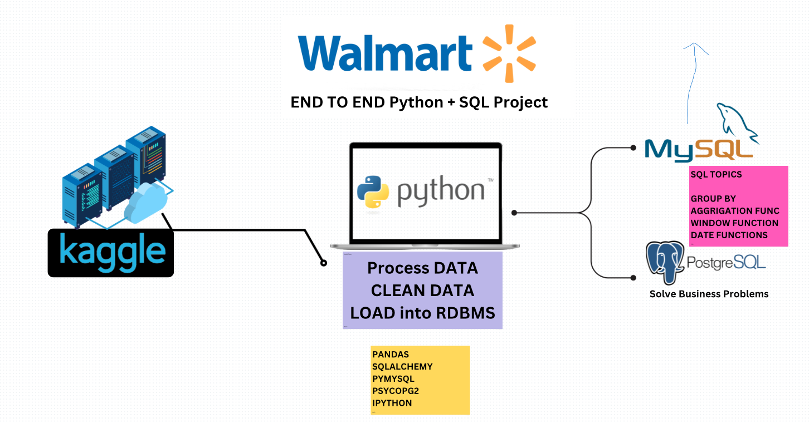

# **Walmart Sales**



# Introduction
In this project, as a Data Analyst, I was responsible for analysing the data provided in a file called [Walmart.csv](Walmart.csv). My objective was to transform the raw data into usable information through preliminary cleaning, data exploration (EDA) and answering several key questions using SQL.

# Background
The Walmart project arose from the need to better understand the commercial performance of a major retailer. The main objective was to transform raw sales data into actionable insights to optimise decision-making.

The dataset used contains crucial information on products, prices, quantities sold and geographical regions. This project highlights the importance of data cleansing to ensure reliable analysis and explores key trends, such as the most profitable products, the most active sales periods, and the most loyal customers.

Using a combination of Python for data pre-processing and SQL for exploratory analysis and targeted question answering, this project illustrates how data analysts can contribute directly to data-driven business strategies.

### The questions I wanted to answer through my SQL queries were:

1. What are the five best-selling products by quantity?
2. What is the busiest day for each branch based on the number of transactions?
3. What is the most active time period for each branch?
4. What is the most common payment method for each branch?
5. What are the total profits for each category, ordered from highest to lowest?

# Tools I Used
To carry out my Walmart project, I took advantage of several essential tools for data cleansing, analysis and results management : 

- **Python:** Used to clean and prepare raw data from Walmart.csv, transforming values and correcting inconsistencies.
- **Pandas and NumPy:** Crucial Python libraries for data manipulation, cleansing and data type conversion.
- **PostgreSQL:** The relational database management system I used to store, query and analyse the cleaned data.
- **Visual Studio Code:** The code editor I chose to write and run my python scripts.
- **Git & GitHub:** Essential for version control and sharing my python and SQL scripts and analysis, ensuring collaboration and project tracking.

# 1. Data Cleaning in Python

Here is my python scripts : [Data Cleaning](data_cleaning.ipynb). The CSV file containing the raw data had a number of quality issues, including null values and data type errors. These issues needed to be resolved before any further analysis or use in an SQL database.

**Actions taken**

- **Null value management :** An initial inspection revealed that some columns, notably _unit_price_ and _quantity_, contained null values. These columns were removed as they were not usable in their current state.

- **Change of data type:** The _unit_price_ column, initially of type _object_, has been converted to type _float_. Before conversion, the $ symbol present in certain entries was removed to avoid subsequent calculation errors. 

- **Harmonisation of column names:** The names of two columns have been changed so that all the letters are in lower case, making them easier to handle in an SQL environment.

These transformations produced a clean file [walmart_clean_data](walmart_clean_data.csv) ready for exploratory analysis.

# 2. Exploratory analysis and answers to key questions in SQL

## Exploratory Data Analysis (EDA)

Here is py SQL scripts : [walmart_queries](walmart_queries.sql). After importing the cleaned data into a PostgreSQL database, an initial exploratory analysis was carried out to understand the structure of the data, identify trends and check its completeness.

## 1. The five best-selling products by quantity

This query helped identify the top-selling product categories by quantity, providing valuable insights into sales trends.

```sql
SELECT 
    category, 
    SUM(quantity) AS total_quantity
FROM walmart
GROUP BY category
ORDER BY total_quantity DESC
LIMIT 5;

```

Here's the breakdown of the best-selling product categories:
- **Fashion Accessories** leads the ranking, showcasing a significant demand for stylish and trendy items.
- **Home and Lifestyle** follows closely behind, reflecting a strong preference for products enhancing everyday living.
- **Electronic Accessories** also sees notable sales, especially with the growing use of tech gadgets.
- **Food and Beverages** maintain steady demand, particularly for convenience and daily essentials.
- **Sport and Travel** rounds out the top five, driven by consumers looking for recreational and travel-related products.

| Category                 | Total Quantity |
|--------------------------|----------------|
| Fashion Accessories      | 9653           |
| Home and Lifestyle       | 9610           |
| Electronic Accessories   | 1494           |
| Food and Beverages       | 952            |
| Sport and Travel         | 920            |

## 2. The busiest day for each branch

This query helps identify the busiest day for each branch, guiding operational strategies and resource allocation.

```sql
SELECT * 
FROM (
    SELECT 
        branch,
        TO_CHAR(TO_DATE(date, 'DD/MM/YY'), 'Day') AS day_name,
        COUNT(*) AS no_transactions,
        RANK() OVER(PARTITION BY branch ORDER BY COUNT(*) DESC) AS rank
    FROM walmart
    GROUP BY branch, day_name
)
WHERE rank = 1;
```

## 3. The most active time period for each branch

This query helped determine the peak times for transactions at each branch, guiding staffing and operational strategies.

```sql
SELECT
    branch,
    CASE 
        WHEN EXTRACT(HOUR FROM time::time) < 12 THEN 'Morning'
        WHEN EXTRACT(HOUR FROM time::time) BETWEEN 12 AND 17 THEN 'Afternoon'
        ELSE 'Evening'
    END AS time_period,
    COUNT(*) AS transaction_count
FROM walmart
GROUP BY branch, time_period
ORDER BY branch, transaction_count DESC;
```

## 4. The most common payment method for each branch

This query helped identify the most popular payment methods for each branch, aiding in optimizing payment processing systems and customer experience.

```sql
WITH payment_stats AS (
    SELECT 
        branch,
        payment_method,
        COUNT(*) AS total_transactions,
        RANK() OVER(PARTITION BY branch ORDER BY COUNT(*) DESC) AS rank
    FROM walmart
    GROUP BY branch, payment_method
)
SELECT branch, payment_method, total_transactions
FROM payment_stats
WHERE rank = 1;
```
## 5. The total profits for each category, ordered from highest to lowest

This query helped identify the total profits by category, offering valuable insights into the most profitable segments and guiding business strategy.

```sql
SELECT 
    category,
    SUM(total * profit_margin) AS total_profit
FROM walmart
GROUP BY category
ORDER BY total_profit DESC;
```

Here's the breakdown of the total profits by category:

- **Fashion Accessories*** leads with the highest total profit, driven by strong sales and high margins on trendy items.
- **Home and Lifestyle** follows closely behind, benefiting from a steady demand for products that improve daily living.
- **Electronic Accessories** ranks third, driven by tech-related products that often have smaller profit margins but high sales volume.
- **Food and Beverages** continues to contribute significantly to total profits, thanks to consistent demand for essential items.
- **Sport and Travel** performs well, boosted by seasonal trends and recreational product sales.
- **Health and Beauty** rounds out the list, with a respectable profit margin but lower overall volume.


| Category                 | Total Profits  |
|--------------------------|----------------|
| Fashion Accessories      | $ 192 314      |
| Home and Lifestyle       | $ 192 213      |
| Electronic Accessories   | $ 30 772       |
| Food and Beverages       | $ 21 552       |
| Sport and Travel         | $ 20 693       |
| Health and Beauty        | $ 18 671       |


# What I Learned

Throughout this project, I honed my skills as a Data Analyst and developed a deeper understanding of how data can be transformed into valuable business insights. Here’s what I took away from the experience:

- **📊 SQL Mastery:** I significantly improved my SQL proficiency, learning how to write complex queries to extract, aggregate, and analyze data effectively. I got comfortable using advanced SQL techniques, such as WITH clauses for temporary tables, RANK() for sorting results dynamically, and grouping and ordering data using GROUP BY and ORDER BY to identify key trends.
- **🔍 Data Exploration and Analysis:** By exploring the data with exploratory data analysis (EDA), I gained a deeper understanding of the dataset’s structure and its nuances. This helped me create SQL queries that could answer business-critical questions, like identifying top-selling products, analyzing transaction patterns by time, and evaluating profit margins across product categories.
- **💡 Data Cleaning:** I learned how crucial data cleansing is to ensure the accuracy and integrity of the analysis. The process of handling missing values, correcting data types, and standardizing column names in Python was essential for creating a reliable dataset that could be queried in SQL.
- **📈 Business Insight Generation:** By answering key business questions, I developed the ability to turn raw data into actionable insights. For example, I was able to identify the most profitable product categories and understand the busiest transaction periods for each branch, which would directly inform decision-making for operations and sales strategies.
- **💻 Tool Integration:** I worked with a combination of powerful tools such as Python, Pandas, NumPy, PostgreSQL, and Git, ensuring smooth data management, analysis, and collaboration. This project solidified my ability to manage data throughout its lifecycle, from cleaning and processing to querying and interpreting results.

# Conclusions

### Insights

The analysis of Walmart sales data revealed key insights that can drive strategic decisions:

- **Top-Selling Categories:** Fashion Accessories and Home and Lifestyle lead in both sales and profits, indicating strong customer demand for these products.
- **Busiest Days & Times:**  Identifying peak days and times for each branch helps optimize staffing and resource allocation.
- **Payment Methods:** Understanding the most common payment methods at each branch enables better customer experience and payment infrastructure planning.
- **Profitable Categories:** Fashion Accessories and Home and Lifestyle also emerged as the most profitable categories, making them prime targets for investment and promotions.

### Business Implications

These insights can help Walmart with:

- **Inventory Management:** Focus on high-demand and high-profit products.
- **Staffing Optimization:** Better resource allocation based on peak transaction times.
- **Payment Systems:** Tailoring payment options to customer preferences.
- **Targeted Marketing:** Focusing promotions on profitable product categories.
